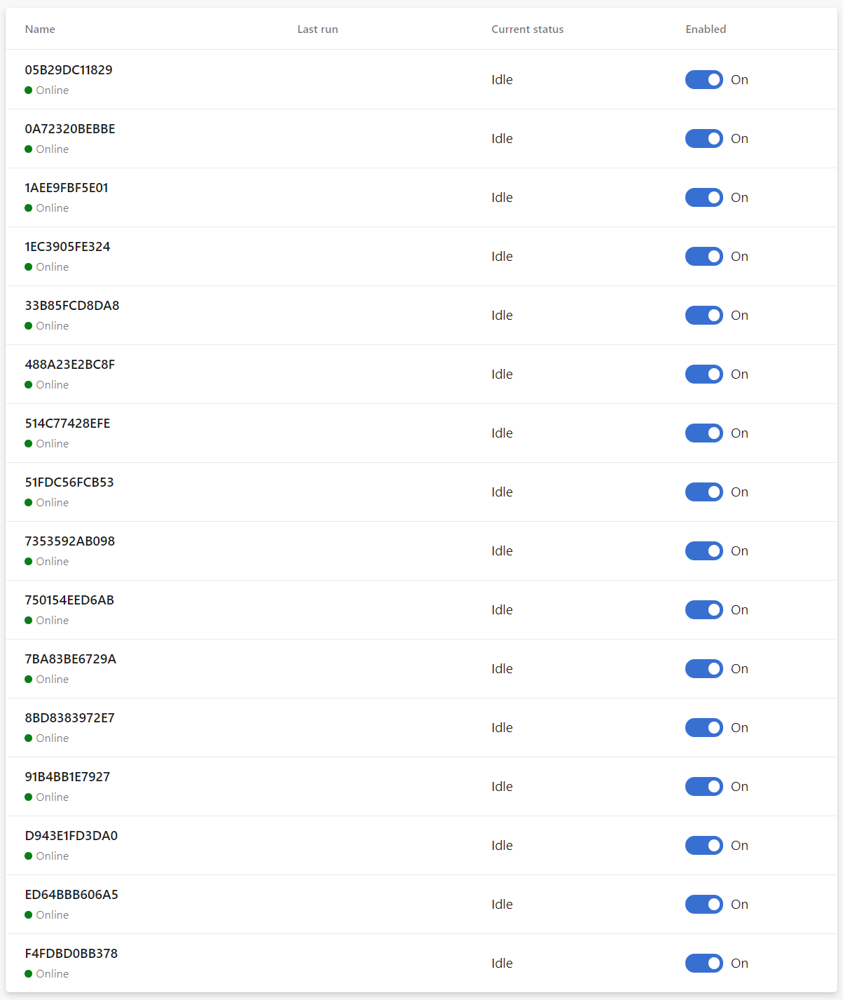
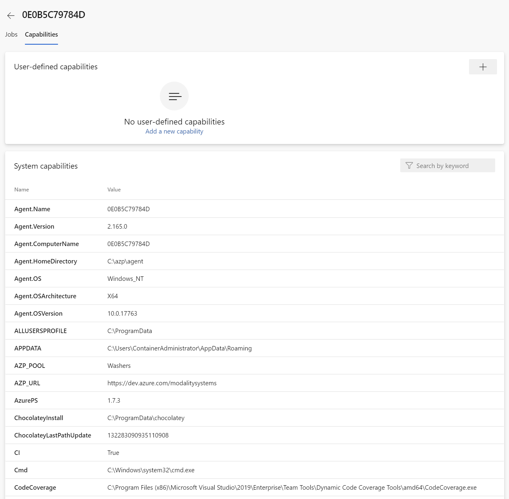
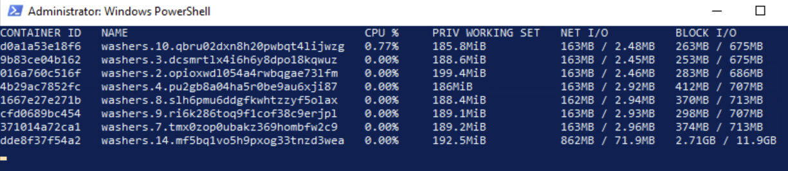
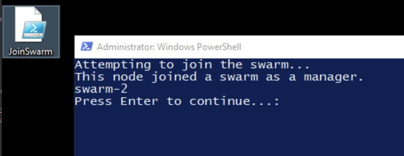
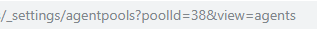

# VSTS-Agent

vsts-agent is a Docker image that includes many build tools for use with Azure DevOps pipelines. When a container is started it will download and register as an Azure agent based on given parameters. This is highly scalable and repeatable.

To get started [Install](https://docs.docker.com/install/windows/docker-ee/) Docker on Windows Server

Create a Docker [Swarm](https://docs.docker.com/engine/swarm/swarm-tutorial/create-swarm/) on 1, 3, 5 or 7 Windows Servers

>From an administrative powershell run the following command:

docker service create --name ? --with-registry-auth --replicas ? --update-failure-action "continue" -e AZP_URL=? -e AZP_TOKEN=? -e AZP_POOL=? -e IMAGE="modalitysystems/vsts-agent:ltsc2019-6.27" -d modalitysystems/vsts-agent:ltsc2019-6.27

>To scale the service run the following command:

docker service scale ?=16

>To update the service run the following command:

docker service update ? --replicas ? --update-parallelism ? -e AZP_URL=? -e AZP_TOKEN=? -e AZP_POOL=? --image modalitysystems/vsts-agent:ltsc2019-6.27

Update Parallelism allows you to define controlled batches to update so --replicas 16 --update-parallelism 8 would update 8, wait until they have all successfully updated and then update the remaining 8. Docker will see the container as being up before Azure sees the agent as being Online.

You should then get a pool of agents in Azure like this:

# Agent Capabilites

When an agent starts up it first downloads the latest version of the agent software, then it performs a capability scan and creates a number of enviroment variables which can be view by going to the capabilities section of each agent.

Capabilites can also appear on this list by adding a line to the Docker file such as "ENV JAVA True" or by passing it in at the Docker command line during run time such as -e AZP_POOL=? or --env-add AZP_POOL=?

For tasks that require the use of CodeCoverage.exe or SqlPackage.exe, their respective PATHS are detailed here.

# Run agent in interactive mode

docker run -it --rm modalitysystems/vsts-agent:ltsc2019-6.27 powershell

Then run:

.\start-envs.ps1

Enter AZP_URL, AZP_TOKEN and AZP_POOL. 
If you want to try a different agent version enter "YES" to AZP_PACKAGE_OVERRIDE followed by a URL. If using this feature, be sure to set "Allow agents in this pool to automatically update" to "OFF" within Azure DevOps.

Then run:

.\start.ps1

# Swarm Diagnostics

Run "docker stats" to get live stats on running containers

Run "docker images" to get a list of all images on host

Run "docker container ls" to get a list of all running containers on a host, add -a to include terminated containers

Run "docker service ls" to get a list of services running in accross the swarm

Run "docker service ps $(docker service ls -q)" to get a breakdown of where the service is running

Run "docker node ls" to get a list of all nodes in a the swarm and "docker node inspect self --pretty" to get info on current node

Run "docker service logs [service]" to show logs for all containers in the service

# Azure based Docker Swarm

Use this [ARM Template](mainTemplate.json) to deploy a Docker Swarm Cluster into [Azure](https://portal.azure.com/#create/Microsoft.Template)

This will also deploy into an Azure DevOps Deployment group so that you can use a pipeline for management. A [token](https://docs.microsoft.com/en-us/azure/devops/organizations/accounts/use-personal-access-tokens-to-authenticate?view=azure-devops&tabs=Windows) will be required for this

Bastion is used from the vnet to connect to all of the hosts

Swarm-1 will automatically initialise the Docker Swarm but manually connecting the other hosts will be required

On each of the other nodes run JoinSwarm.ps1 that should be on the desktop. This will use remote PowerShell to connect to Swarm-1 to retreive the required token and then join the node to the swarm as a manager

Then pull the required images to each host by running "docker pull modalitysystems/vsts-agent:ltsc2019-6.27"

# Azure Container Registry (ACR)

The images used in the examples above are stored on Docker Hub and not maintained
  
ACR should be deployed and used in your environment for pushing and pulling images to the Docker Swarm. A service enpoint is configured on the VNET for optimal performance

Once an ACR excists in your environment run "docker login --password ? --username ? [acr-url]" from each node of the swarm

On one of the nodes in the swarm, download and extract [vsts-agent-ltsc2019](https://github.com/modalitysystems/vsts-agent/releases/tag/ltsc2019)

From the extracted folder run "docker build -t [acr-url]/vsts-agent:[version] .

Once it has finished building run "docker image push [acr-url]/vsts-agent:[version]"

Then when the image has finished pushing run "docker pull [acr-url]/vsts-agent:[version]" from each of the other nodes in the swarm

# CleanUp Offline Agents

When the Docker service starts a new container based agent, it will get the name of it's virtual MAC address which will come from the Hyper-V MAC pool. When the container is stopped, the old agent will remain in Azure DevOps in an Offline state. This [Rest API Script](scripts/ClearUpAgents.ps1) can be used to delete any Offline Agents. When using the ARM template to deploy into Azure, there is an Automation Account called "ClearUpAgents" that can be run to do this. It is also run automatically once a day.

To get the Pool ID, navigate to the required Agent Pool in Azure DevOps and look in the browser address bar

# Notes

>[Click here view image on Docker Hub](https://hub.docker.com/r/modalitysystems/vsts-agent)

>[Click here for list of installed tools](tools.md)

>[Click here for notes on how to customise the image](customise.md)

>[Click here for notes on basic troubleshooting tips](troubleshoot.md)
